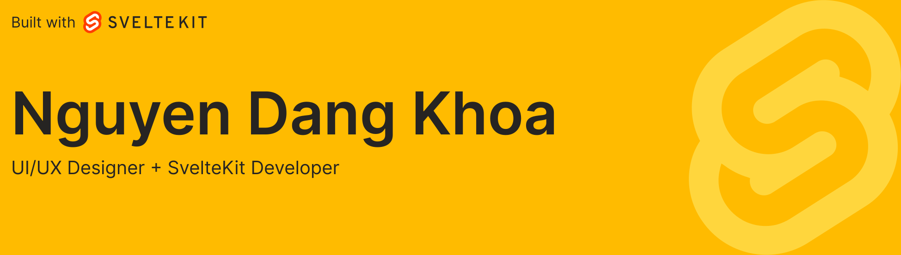

<div align='center'><a href='https://www.websitecounterfree.com'></a><br / ><small><a href='https://www.websitecounterfree.com' title="Free Website Counter"></a></small></div>


🌐 Portfolio: https://wentallout.io.vn

🔥 Fiverr: https://www.fiverr.com/wentallout

⌨ Monkeytype: https://monkeytype.com/profile/wentallout

😎 Name: Nguyen Dang Khoa

🗺 Location: Ho Chi Minh City, Vietnam

🏓 Hobbies: Mechanical keyboards, video games, music, sci-fi movies

<!--START_SECTION:waka-->

```txt
Svelte        8 hrs 59 mins   █████████████████████░░░░   83.62 %
TypeScript    1 hr 36 mins    ███▓░░░░░░░░░░░░░░░░░░░░░   14.91 %
JSON          3 mins          ░░░░░░░░░░░░░░░░░░░░░░░░░   00.60 %
Other         3 mins          ░░░░░░░░░░░░░░░░░░░░░░░░░   00.54 %
JavaScript    1 min           ░░░░░░░░░░░░░░░░░░░░░░░░░   00.22 %
```

<!--END_SECTION:waka-->


## Stack

<table>
  <tr>
    <td align="center" width="96">
        
      <br>SvelteKit
    </td>
      <td align="center" width="96">
        
      <br>TailwindCSS
    </td>
    <td align="center" width="96">
        
      <br>Godot
    </td>
     <td align="center" width="96">
        
      <br>VSCode
    </td>
    <td align="center" width="96">
        
      <br>Figma
    </td>
    <td align="center" width="96">
        
      <br>Photoshop
    </td>
  </tr>
</table>

## Contact

✉️ Email: wentallout@gmail.com

<a href="https://www.buymeacoffee.com/wentallout" target="_blank"></a>

## Stat

<a href="https://github.com/wentallout">
  
</a>
<a href="https://github.com/wentallout">
  
</a>

## What is Svelte?

Svelte is quite different from other modern client-side JavaScript frameworks such as React. Svelte is a compiler that shifts your work into a compile step rather than using a Virtual DOM. This happens when you build your app by converting the components into highly efficient code.


