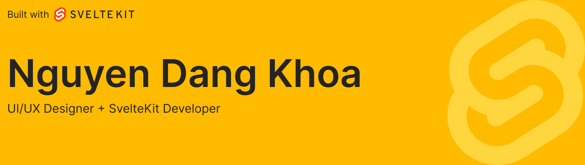

- Contact me at: wentallout@gmail.com
- Working on: https://learn-less.netlify.app/
- Portfolio: https://wentallout.io.vn

## My Tech Stack

- TypeScript: Main coding language
- [SvelteKit](https://svelte.dev): Main fullstack web framework
- [TailwindCSS](https://tailwindcss.com), [shadcn-svelte](https://shadcn-svelte.com): styling your app
- Postgres, [Supabase](https://supabase.com): database
- [Zod](https://zod.dev): validation
- [Netlify](https://www.netlify.com): deploy
- [Playwright](https://playwright.dev/), [sveltest.dev](https://sveltest.dev/): testing
- [better-captcha](https://www.better-captcha.dev): captcha
- [Antigravity](https://antigravity.google): AI Assistant

<table>
  <tr>
    <td align="center" width="96">
          
    </td>
    <td align="center" width="96">
        
    </td>
     <td align="center" width="96">
        
    </td>
    <td align="center" width="96">
        
    </td>
  </tr>
</table>

## AI Global rules

[forrestchang/andrej-karpathy-skills](https://github.com/forrestchang/andrej-karpathy-skills/blob/main/CLAUDE.md)

## MCPs

MCPs let your agent connect to outside tools (browser, internet, api)

- [Serena](https://github.com/oraios/serena): coding agent toolkit
- [Supabase MCP](https://supabase.com/docs/guides/getting-started/mcp): MCP to interact with supabase database
- [Svelte MCP](https://svelte.dev/docs/ai/remote-setup): very important because I mainly use Svelte
- [Context7](https://context7.com)
- [mcp-playwright](https://github.com/executeautomation/mcp-playwright)
- [Tavily MCP](https://github.com/tavily-ai/tavily-mcp)

## Skills

Skills are basically upgrades for your agent, they help them do a specific task better, faster in a more structured way.
This is a needle in a haystack proble, there are too many skills out there. Imma try to keep it simple and ignore the noises.

- [write-like-a-human](https://github.com/wentallout/write-like-a-human): a new skill I made that allow you to help your AI writes like humans, no more common AI patterns (not just X, but Y kind of pattern)
- [midudev/autoskills](https://github.com/midudev/autoskills): Automatically find your agent a bunch of relevant skills by scanning your project
- [skills.sh](https://skills.sh): find more skills
- https://github.com/obra/superpowers
- [marketingskills by Corey](https://github.com/coreyhaines31/marketingskills): marketing

## Security

https://www.promptfoo.dev/

### Design with AI

- [VoltAgent/awesome-design-md](https://github.com/VoltAgent/awesome-design-md/tree/main)
- [skills/frontend-design](https://github.com/anthropics/skills/tree/main/skills/frontend-design)
- [anthropics/canvas-design](https://github.com/anthropics/skills/blob/main/skills/canvas-design/SKILL.md)

## Research

- [GPTR](https://gptr.dev) - AI mate for rapid deep research
- [autoresearch](https://github.com/karpathy/autoresearch)

## Main strategy to coding with AI

- We have 2 types of projects: well-known requirements (domain experience, well defined user stories, usage requirements, dataset requirements) and uncertain requirements (vibes, experiments, prototypes).
- For well-known requirements, we always go with PLAN MODE, build as much context into your plan as possible, iterate on the plan multiple time, read the plan, make sure every edge cases are covered. Then from PLAN we go into IMPLEMENT. During IMPLEMENT we're gonna have to deal with missed requirements and bad codes, which leads to us iterating on it for a long time until it's completed and we can play and test it.
- For Uncertain Requirements: PROMPT -> PROMPT -> PROMPT -> ITERATE
- Stick to one task/feature in one coding session, clean your session frequently
- [tldraw](https://www.tldraw.com): Whiteboarding
- [Fallow](https://docs.fallow.tools): Clean your messy AI generated code:
- [sci-bot](https://sci-bot.ru),, https://github.com/199-biotechnologies/claude-deep-research-skill: research is important
- [gitingest](https://gitingest.com): Turn repo into text for LLMs.
- https://github.com/travisvn/awesome-claude-skills

[Building Products people want to live in](https://medium.com/design-bootcamp/building-products-people-want-to-live-in-1420fa4decbf)

## Context Engineering

The name of the game is that you only have approximately 170k of context window to work with. So it's essential to use as little of it as possible. The more you use the context window, the worse the outcomes you'll get.

Frequent Intentional Compaction: building your entire workflow around context management
Goal: Keep Context Utilization under 40%

Three phases: Research, Plan, Implement.

- Research step: Understand how the system works, find all relevant files, explore causes of XYZ bug.
- Plan step: outline the exact implementation steps, include file names, lines and snippets, explicit about testing steps
- Implement step: Go write the code. "If properly planned, the implementation is easy and expected." Keep context under 40%

This is not magic => You still have to read the PLAN.

## Useful links

- [Signs_of_AI_writing](https://en.wikipedia.org/wiki/Wikipedia:Signs_of_AI_writing)
- [arena.ai - Coding category](https://arena.ai/leaderboard/text/coding)
- [SvelteBench - LLM benchmark for Svelte 5](https://github.com/khromov/svelte-bench)
- [Slow down and write better with AI](https://mariozechner.at/posts/2026-03-25-thoughts-on-slowing-the-fuck-down)
- [Moving from React to Svelte](https://strawberrybrowser.com/blog/react-to-svelte)

## Other cool stuff I dont use

Task Master AI MCP: https://github.com/eyaltoledano/claud...
[Tavily](https://github.com/tavily-ai/tavily-mcp): Search stuff
9. Codebase Memory MCP: https://github.com/DeusData/codebase-...
- [Doc Co-Authoring](https://github.com/anthropics/skills/blob/main/skills/doc-coauthoring/SKILL.md)
- Marketing Skills by Corey Haines: https://github.com/coreyhaines31/mark...
- Claude SEO: https://github.com/AgriciDaniel/claud...
- Brand Guidelines: https://github.com/anthropics/skills/...
- Deep Research Skill: [https://github.com/199-biotechnologie...](https://github.com/199-biotechnologies/claude-deep-research-skill)
- GPT Researcher: https://github.com/assafelovic/gpt-re...
- [Obsidian Skills](https://github.com/kepano/obsidian-skills)
- Firecrawl: https://github.com/mendableai/firecrawl
- Langflow: https://github.com/langflow-ai/langflow

## Making videos 

Remotion: https://github.com/remotion-dev/remotion

## Making custom skills

https://github.com/anthropics/skills/tree/main/skills/skill-creator

## Context 
Context Optimization: https://github.com/muratcankoylan/Agent-Skills-for-Context-Engineering/blob/main/skills/memory-systems/SKILL.md

## Security
promptfoo: https://github.com/promptfoo/promptfoo

## Find more skills

- Official Anthropic Skills Repo: https://github.com/anthropics/skills
- SkillsMP: https://skillsmp.com
- SkillHub: https://skillhub.club

## News

https://tom-doerr.github.io/repo_posts/

## My VSCode theme

😎 [khoaneostyle](https://marketplace.visualstudio.com/items?itemName=wentallout.khoaneostyle)
