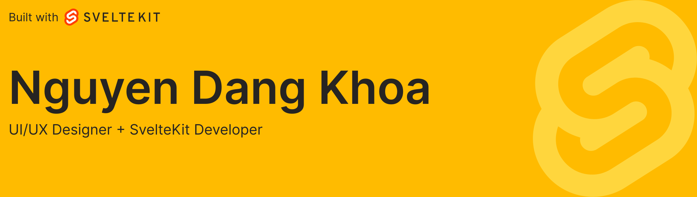
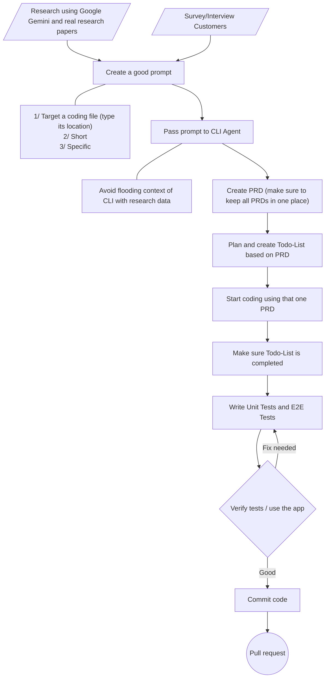

- Contact me at: wentallout@gmail.com
- Working on: https://learn-less.netlify.app/
- Portfolio: https://wentallout.io.vn
- Keyboard: https://www.youtube.com/shorts/vtMTHZl_FTY
- 😎 [khoaneostyle](https://marketplace.visualstudio.com/items?itemName=wentallout.khoaneostyle)

## My workflow

- Plan first.
- Try to use `low` effort.
- Stay in 40-60% of used tokens.
- Clean your session.
- You AGENTS.md might be too long, keep it simple.
- AGENTS.md should have this: 

```md
## Workflow

Don't explore the codebase beyond any explicitly mentioned files and folders.

If unsure about an API, write small scripts, print out information, to make an informed decision about next steps.
```


```mermaid
graph TD
    A[/Research using Google Gemini and real research papers/]
    B[/Survey/Interview Customers/]
    
    C["Create a good prompt"]
    C_Note["1/ Target a coding file (type its location)<br>2/ Short<br>3/ Specific"]
    
    D["Pass prompt to CLI Agent"]
    D_Note["Avoid flooding context of CLI with research data"]
    
    E["Create PRD (make sure to keep all PRDs in one place)"]
    F["Plan and create Todo-List based on PRD"]
    G["Start coding using that one PRD"]
    H["Make sure Todo-List is completed"]
    I["Write Unit Tests and E2E Tests"]
    
    J{"Verify tests / use the app"}
    
    K["Commit code"]
    L(("Pull request"))

    %% Connections
    A --> C
    B --> C
    C --- C_Note
    
    C --> D
    D --- D_Note
    
    D --> E
    E --> F
    F --> G
    G --> H
    H --> I
    I --> J
    
    J -->|Good| K
    J -->|Fix needed| I
    
    K --> L
```

## 🛠️ Skills & Technologies

          

## AI Global rules

[forrestchang/andrej-karpathy-skills](https://github.com/forrestchang/andrej-karpathy-skills/blob/main/CLAUDE.md)

## MCPs

MCPs let your agent connect to outside tools (browser, internet, api)

- [Serena](https://github.com/oraios/serena): coding agent toolkit
- [Supabase MCP](https://supabase.com/docs/guides/getting-started/mcp): MCP to interact with supabase database
- [Svelte MCP](https://svelte.dev/docs/ai/remote-setup): very important because I mainly use Svelte
- [Context7](https://context7.com)
- [mcp-playwright](https://github.com/executeautomation/mcp-playwright)
- [Tavily MCP](https://github.com/tavily-ai/tavily-mcp)

## Skills/MCPs/Tools

- [write-like-a-human](https://github.com/wentallout/write-like-a-human): a new skill I made that allow you to help your AI writes like humans, no more common AI patterns (not just X, but Y kind of pattern)
- [midudev/autoskills](https://github.com/midudev/autoskills): Automatically find your agent a bunch of relevant skills by scanning your project
- [skills.sh](https://skills.sh): find more skills
- https://github.com/obra/superpowers
- [marketingskills by Corey](https://github.com/coreyhaines31/marketingskills): marketing
- [modern-web-guidance](https://developer.chrome.com/docs/modern-web-guidance): essential web skills by google
- [Security with Promptfoo](https://www.promptfoo.dev)
- [VoltAgent/awesome-design-md](https://github.com/VoltAgent/awesome-design-md/tree/main)
- [skills/frontend-design](https://github.com/anthropics/skills/tree/main/skills/frontend-design)
- [anthropics/canvas-design](https://github.com/anthropics/skills/blob/main/skills/canvas-design/SKILL.md)
- [GPTR](https://gptr.dev) - AI mate for rapid deep research
- [autoresearch](https://github.com/karpathy/autoresearch)
- [tldraw](https://www.tldraw.com): Whiteboarding
- [Fallow](https://docs.fallow.tools): Clean your messy AI generated code:
- [sci-bot](https://sci-bot.ru),, https://github.com/199-biotechnologies/claude-deep-research-skill: research is important
- [gitingest](https://gitingest.com): Turn repo into text for LLMs.
- https://github.com/travisvn/awesome-claude-skills

## Other cool stuff I dont use

[Tavily](https://github.com/tavily-ai/tavily-mcp): Search stuff
- [Doc Co-Authoring](https://github.com/anthropics/skills/blob/main/skills/doc-coauthoring/SKILL.md)
- [Marketing Skills by Corey Haines](https://github.com/coreyhaines31/marketingskills)
- Claude SEO
- Deep Research Skill: [https://github.com/199-biotechnologie...](https://github.com/199-biotechnologies/claude-deep-research-skill)
- GPT Researcher: https://github.com/assafelovic/gpt-re...
- [Obsidian Skills](https://github.com/kepano/obsidian-skills)
- Firecrawl: https://github.com/mendableai/firecrawl
- Langflow: https://github.com/langflow-ai/langflow
- Remotion: https://github.com/remotion-dev/remotion

## Making custom skills

https://github.com/anthropics/skills/tree/main/skills/skill-creator

## Security

promptfoo: https://github.com/promptfoo/promptfoo

## Find more skills

- Official Anthropic Skills Repo: https://github.com/anthropics/skills
- SkillsMP: https://skillsmp.com
- SkillHub: https://skillhub.club

## News

- [Beautiful HTML Slides]https://github.com/zarazhangrui/beautiful-html-templates

## Useful links

- [Is Your Site Agent-Ready?](https://isitagentready.com)
- [Layout without breakpoints](https://frontendmasters.com/blog/building-a-ui-without-breakpoints)
- [Repo Posts](https://tom-doerr.github.io/repo_posts)
- [Building Products people want to live in](https://medium.com/design-bootcamp/building-products-people-want-to-live-in-1420fa4decbf)
- [Signs_of_AI_writing](https://en.wikipedia.org/wiki/Wikipedia:Signs_of_AI_writing)
- [arena.ai - Coding category](https://arena.ai/leaderboard/text/coding)
- [SvelteBench - LLM benchmark for Svelte 5](https://github.com/khromov/svelte-bench)
- [Slow down and write better with AI](https://mariozechner.at/posts/2026-03-25-thoughts-on-slowing-the-fuck-down)
- [Moving from React to Svelte](https://strawberrybrowser.com/blog/react-to-svelte)
